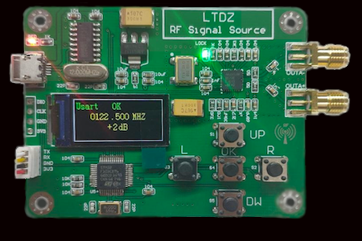

Description:
============

This software distribution contains, command line tool, libraries and a GUI frontend to configure LTDZ MAX2870 signal generator compatible boards.



Command Line Tool:
==================

sigenmax2870 is a utility program able to program  LTDZ MAX2870 signal generator compatible boards by pc, using serial port.

Prerequisites:
==============

The programs is compatible with MacOS and Linux ( both x86 and Arm distributions) and it's tested using the following OSs:

- Macos Ventura 13.1         (m1 ARM)    compiled with Apple clang version 14.0.0 (clang-1400.0.29.202)
- Macos Monterey 12.6.2      (x86_64)       compiled with Apple clang vesrion  14.0.0 (clang-1400.0.29.202)

- Debian 12 ( Bookworm )     (aarch64)   compiled with gcc 12.2.0
- Ubuntu22LTS                (x86_64)    compiled with gcc 11.3.0 ( See Ubuntu Troubleshooting ! )

To compile the suite, the following tools are required:

- Autotools
- Libtool
- Automake

As example, the following commands will install the required dependencies on Debian / Ubuntu unvironments:

apt-get install build-essentials
apt-get install automake
apt-get install libtool

Ubuntu Troubleshooting:
=======================

The product Id of these boards is assigned to a model of braille board, so it isn't recognized correctly:

# lsusb

... <omissis> ...
Bus 002 Device 006: ID 1a86:7523 QinHeng Electronics CH340 serial converter
... <omissis> ...


As workaround, open the followuing file:

# vi /usr/lib/udev/rules.d/85-brltty.rules

then comment the line related to the Device: 1A86:7523 

Installation:
=============

- launch the configure script:
  ./configure
- Compile the program:
  make
- Install the program and the man page:
  sudo make install

Quick Start:
============

The following is the basic syntax for the command line tool:

```
sigenmax2870 <-d device_path> <-f frequency_kHz> <-a amplification> [-p]
```
 
Where:

* -d means 'device' and  **device_path** is the full path of the special device associated to the board;
* -f maens frequency and  **frequency_kHz** it the frequency to generate in kHz;
* -a pean amplification and **amplification** is one of the following values ( corresponding to -4dB, -1dB, +2dB, +5dB ):
```
1,2,3 or 4
```
* -p means 'print' , it is the only optional parameter. If present the binary representation of the command will be printed on stdout.

Command Line Examples:
=====================

- Set the device to generate a 40.666MHz signal:<BR>
   ./sigenmax2870 -d /dev/tty.usbserial-110 -f 40666 

- Same as the previoius example but this one also show the command sent to the device:<BR>
  <./sigenmax2870 -d /dev/tty.usbserial-110 -f 40666 -p <BR>
  Response Length: 43<BR>
  216.58.205.195<BR>

Further documentation:
======================

See the man page included in this release.

License:
========

[* This work is licensed under a Creative Commons Attribution-NonCommercial 4.0 International License](http://creativecommons.org/licenses/by-nc/4.0/)
[](http://creativecommons.org/licenses/by-nc/4.0/)
